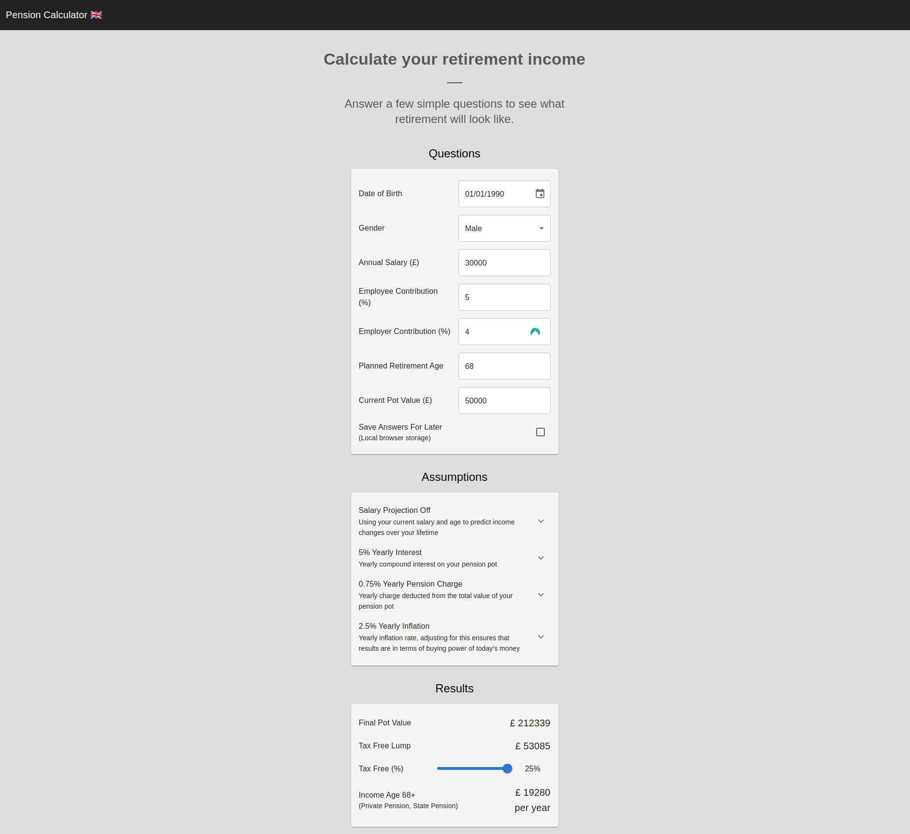

# pension-calculator-web-azure

See also [AWS alternative](https://github.com/BenRamsden/pension-calculator-web-aws).



# Structure

- [app](./app) - ReactJS frontend
- [functions](./functions) - Azure Functions
- [pulumi](./pulumi) - Infrastructure as code

# Local Development

## Run app

```shell
cd app
yarn
yarn dev
```

## Develop against local backend

```shell
echo "VITE_FUNCTION_ENDPOINT=http://localhost:7071/api/VisitorCounter" >> app/.env.local
yarn dev
```

## Run api

See [functions/README.md](./functions/README.md).

# CI Deployment Setup

## Azure service principal

> :warning: To run this you will need to set up an azure subscription in the portal.
> :warning: To run this you will need to `pulumi up` locally manually to set up the resourceGroup.
> This creates an "app registration" in Entra ID and assigns the `contributor` role to the resource group.

```shell
az ad sp create-for-rbac --name "myApp" \
  --role contributor \
  --scopes /subscriptions/{subscription-id}/resourceGroups/{resource-group} \
  --json-auth
```

- Take `clientId` and set it as `ARM_CLIENT_ID` in GitHub secrets
- Take `clientSecret` and set it as `ARM_CLIENT_SECRET` in GitHub secrets
- Take `tenantId` and set it as `ARM_TENANT_ID` in GitHub secrets
- Take `subscriptionId` and set it as `ARM_SUBSCRIPTION_ID` in GitHub secrets
- Additionally, if you plan to use Azure CLI through GitHub actions set `AZURE_CREDENTIALS` to the whole JSON output

## Pulumi access token

- Create a new personal access token in Pulumi and set it as `PULUMI_ACCESS_TOKEN` in GitHub secrets

# Manual deployment steps

```shell
cd pulumi
yarn
pulumi up
```

# Updating source data

> Data calculations are based on are stored in `app/src/data/`. Below are the sources and transformations applied to this data.

- Life expectancy projection [ONS](https://www.ons.gov.uk/peoplepopulationandcommunity/birthsdeathsandmarriages/lifeexpectancies/datasets/expectationoflifeprincipalprojectionunitedkingdom)
  - Books
    - males cohort ex
    - females cohort ex
  - Conversion steps
    - delete text
    - select all
    - paste into another doc
    - save as csv
    - use csv to json converter
- Salary percentiles by age [ONS](https://occaminvesting.co.uk/average-uk-salary-by-age/)
- State pension age [Which](https://www.which.co.uk/money/pensions-and-retirement/state-pension/state-pension-age-calculator-aIGrn9D5tei4)
- Earnings over time [ONS](https://www.ons.gov.uk/employmentandlabourmarket/peopleinwork/earningsandworkinghours/datasets/agegroupashetable6)
  - Doc: `Annual pay - Gross 2022`
  - Book: `Full-Time`
  - Column: `Median`
